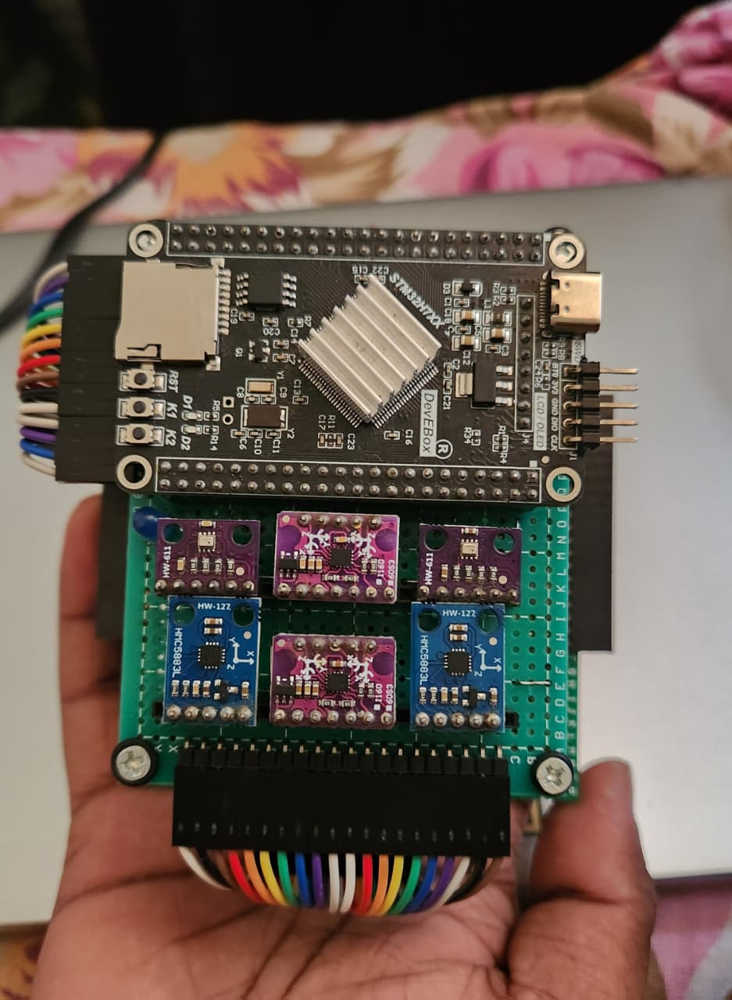
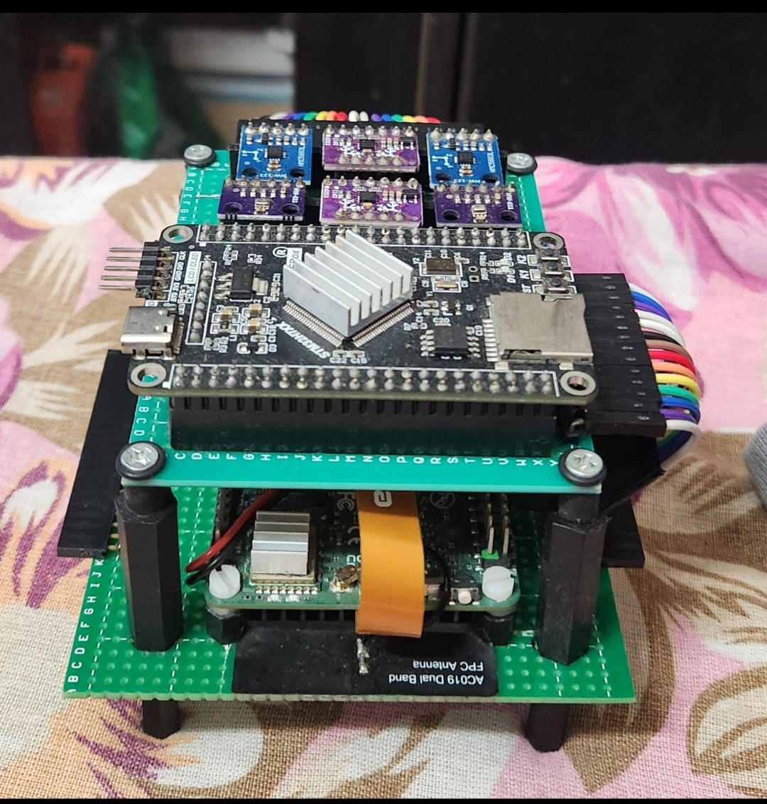
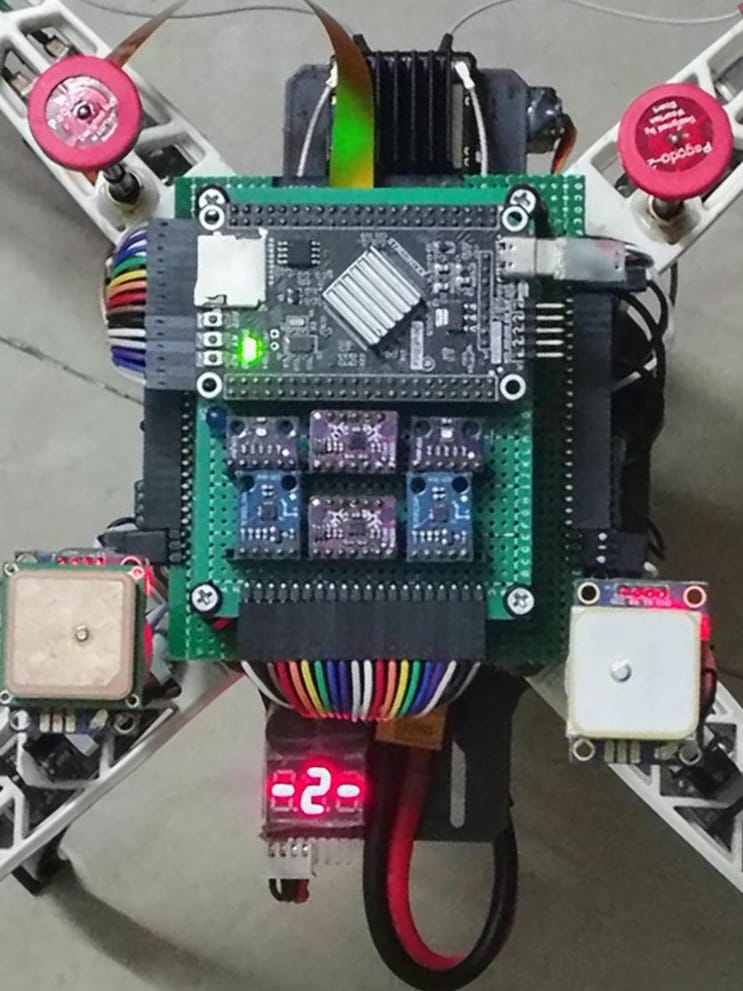
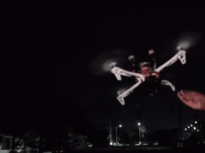
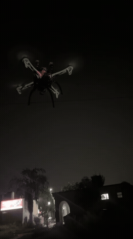
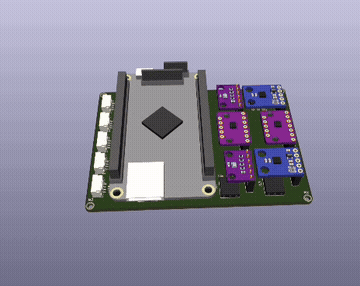

# Prometheus FC

Custom ArduPilot Hardware Definition, Bootloader, Firmware, and Configuration for the **DevEBox STM32H743VIT6 V3.0** Flight Controller with **Dual-Sensor Redundancy**.

---

## Overview

**Prometheus FC** turns a low-cost, high-performance generic **DevEBox STM32H743VIT6 V3.0** development board into a flight controller running **ArduCopter V4.8.0-dev**. 

Unlike off-the-shelf commercial flight controllers with soldered onboard sensors, this design gives you full control over external sensor wiring with complete dual-bus isolation:
* **Dual IMU Redundancy:** 2× BMI160 on isolated SPI buses (SPI1 + SPI4)
* **Dual Barometer Redundancy:** 2× BMP280 on isolated SPI buses (SPI1 + SPI4)
* **Dual Compass Support:** 2× External Compasses on independent I2C buses (I2C1 + I2C2)
* **Dual GPS Support:** 2× u-blox GPS modules on dedicated serial ports (USART1 + USART6)
* **Dedicated Motor DMA:** TIM4 motor outputs (PD12–PD15) with dedicated DMA streams to prevent GPS UART collisions
* **Full Dataflash Logging:** Onboard MicroSD card slot via 4-bit SDMMC1

---

## Hardware Gallery

| Top View (DevEBox + Sensors) | Front View | Mounted on Drone Frame |
| :---: | :---: | :---: |
|  |  |  |

---

## Hardware Specifications

| Parameter | Specification |
| :--- | :--- |
| **Microcontroller** | STM32H743VIT6 (ARM Cortex-M7 @ 480 MHz, double-precision FPU) |
| **Flash Memory** | 2048 KB (128 KB Bootloader + 1664 KB Firmware + 256 KB Flash Storage) |
| **RAM** | 1024 KB SRAM + 64 KB ITCM RAM |
| **Oscillator** | 25 MHz HSE Crystal (Y2 on board) |
| **ArduPilot Board ID** | **7121** (`AP_HW_DevEBoxH743`) |
| **USB Interface** | USB-C (OTG_FS, PA11 / PA12) |
| **SD Storage** | MicroSD slot connected to SDMMC1 (4-bit FatFS logging) |
| **Parameter Storage** | Internal Flash Pages 14–15 (32 KB persistent EEPROM emulation) |

---

## Repository Directory Structure

```
Prometheus FC/
├── README.md                                  # This documentation
├── hwdef.dat                                  # ArduPilot ChibiOS hardware definition
├── hwdef-bl.dat                               # ArduPilot bootloader hardware definition
├── DevEBoxH743_Prometheus_FC_Pinout_Guide.txt # Complete wire-by-wire connection guide
│
├── media/                                     # Flight test videos, hardware photos, and 3D CAD renders
│   ├── FC_topview.jpeg                        # Hardware top view
│   ├── FC_FrontView.jpeg                      # Hardware front connector view
│   ├── FC_on_F450frame.jpeg                   # Flight controller mounted on quadcopter frame
│   ├── 1st_flight_prometheusFC_withstock_pixhawkPIDs.mp4            # Maiden flight test video
│   ├── 2nd_flightTest_loitermode_gpsLock_after_MinorPIDs_tuning.mp4 # Loiter mode GPS lock flight test
│   └── PrometheusFC_kicad3d.mp4               # KiCad 3D CAD animation
│
├── bootloader/                                # Pre-compiled bootloader binaries
│   ├── Prometheus-FC_bl.bin                   # Raw binary (for DFU / ST-Link at 0x08000000)
│   └── Prometheus-FC_bl.hex                   # Intel HEX (for STM32CubeProgrammer)
│
├── firmware/                                  # Pre-compiled ArduCopter firmware
│   ├── arducopter.apj                         # ArduPilot package (for Mission Planner / QGC / uploader.py)
│   ├── arducopter.bin                         # Raw binary (for DFU at 0x08020000)
│   └── arducopter_with_bl.hex                 # Complete chip image (Bootloader + Firmware combined)
│
├── parameters/                                # Tested vehicle configuration files
│   └── prometheus_s500_tested.param           # 1004 calibrated parameters from real flight testing
│
├── patches/                                   # ArduPilot source tree patches
│   ├── 0001-AP_InertialSensor_BMI160.patch    # SPI 0x7F wakeup sequence & clone chip ID (0xD3) support
│   ├── 0002-AP_Notify_Buzzer_LED_sync.patch   # Status LED (PE2) synchronization with buzzer tones
│   └── 0003-board_types_7121.patch            # Registration of Board ID 7121 in board_types.txt
│
└── scripts/                                   # Automation and diagnostic tools
    ├── install.sh                             # One-command installer: copies hwdef & applies patches
    ├── flash_bootloader.sh                    # Flashes bootloader via dfu-util or st-flash
    └── deep_sensor_check.py                   # Live MAVLink verification script for all dual sensors
```

---

## 🎥 Flight Testing & Video Demonstrations

Real flight footage and CAD design demonstrations recorded from the test vehicle:

| Download for Preview | Flight Details & Technical Highlights |
| :---: | :--- |
| <a href="media/2nd_flightTest_loitermode_gpsLock_after_MinorPIDs_tuning.mp4"><br><sub>▶️ <b>Watch Full Video (MP4, 60fps)</b></sub></a> | **1. Flight Test 2: Autonomous Loiter Mode & GPS Lock**<br><br>• **Test Objective:** Autonomous position-hold in **Loiter mode** following minor rate PID tuning.<br>• **Results:** Rock-solid GPS lock, zero horizontal drift, stable altitude hold, and smooth dual-sensor EKF3 fusion.<br>• **Footage:** [`media/2nd_flightTest_loitermode_gpsLock_after_MinorPIDs_tuning.mp4`](media/2nd_flightTest_loitermode_gpsLock_after_MinorPIDs_tuning.mp4) (20s, 60fps) |
| <a href="media/1st_flight_prometheusFC_withstock_pixhawkPIDs.mp4"><br><sub>▶️ <b>Watch Full Video (MP4, 30fps)</b></sub></a> | **2. Flight Test 1: Maiden Hover with Stock Pixhawk PIDs**<br><br>• **Test Objective:** Initial takeoff and hover test right after firmware flashing.<br>• **Results:** Safe takeoff and baseline hover stability operating on default multicopter PID parameters.<br>• **Footage:** [`media/1st_flight_prometheusFC_withstock_pixhawkPIDs.mp4`](media/1st_flight_prometheusFC_withstock_pixhawkPIDs.mp4) (10s, 30fps) |
| <a href="media/PrometheusFC_kicad3d.mp4"><br><sub>▶️ <b>Watch Full Video (MP4, 60fps)</b></sub></a> | **3. KiCad 3D Hardware CAD Board Design**<br><br>• **Design:** Custom PCB carrier board for the DevEBox STM32H743 module.<br>• **Results:** 3D CAD visualization showing component placement, header pin routing, and sensor bus layout.<br>• **Footage:** [`media/PrometheusFC_kicad3d.mp4`](media/PrometheusFC_kicad3d.mp4) (10s, 60fps) |

---

## Confirmed Sensor & Peripheral Mapping

All sensors listed below have been verified in hardware and flight-tested:

| Subsystem | Hardware | Bus / Peripheral | Pins | Status | Notes |
| :--- | :--- | :--- | :--- | :--- | :--- |
| **IMU 1** | Bosch BMI160 | SPI1 | SCK: PA5, MISO: PA6, MOSI: PD7, **CS: PB5** | ✅ Working | Primary IMU, ROTATION_ROLL_180 |
| **IMU 2** | Bosch BMI160 | SPI4 | SCK: PE12, MISO: PE13, MOSI: PE14, **CS: PD4** | ✅ Working | Secondary IMU, clone chip (ID `0xD3`) |
| **Baro 1** | Bosch BMP280 | SPI1 | Shared SPI1 bus, **CS: PB12** | ✅ Working | Primary Baro |
| **Baro 2** | Bosch BMP280 | SPI4 | Shared SPI4 bus, **CS: PB13** | ✅ Working | Secondary Baro |
| **Compass 1** | External HMC5883L/QMC5883L | I2C1 | SCL: PB6, SDA: PB7 | ✅ Working | Primary Compass |
| **Compass 2** | External HMC5883L/QMC5883L | I2C2 | SCL: PB10, SDA: PB11 | ✅ Working | Secondary Compass |
| **GPS 1** | u-blox M8N | USART1 (SERIAL1) | TX: PA9, RX: PA10 | ✅ Working | 115200 baud, 3D Fix |
| **GPS 2 / Telem** | u-blox M8N / Aux | USART6 (SERIAL5) | TX: PC6, RX: PC7 | ✅ Working | 115200 baud (or configurable for MAVLink) |
| **Companion** | Radxa Cubie A7S | USART2 (SERIAL2) | TX: PD5, RX: PD6 | ✅ Working | MAVLink2 link, 115200 baud |
| **Telemetry** | Radio / LoRa | USART3 (SERIAL3) | TX: PD8, RX: PD9 | ✅ Working | MAVLink2, 57600 baud |
| **RC Receiver** | FlySky FS-iA10B (iBUS) | UART4 (SERIAL4) | RX: PB8, TX: PB9 | ✅ Working | Serial RC Input (`SERIAL4_PROTOCOL=23`) |
| **Motors 1–4** | BLHeli_S / PWM ESCs | TIM4 (PWM 1–4) | **PD12, PD13, PD14, PD15** | ✅ Working | TIM4 with isolated DMA stream |
| **Battery Volt** | Voltage Divider | ADC1 | PA2 (ADC1_IN14) | ✅ Working | Scale: 11.0 (`HAL_BATT_VOLT_SCALE`) |
| **Battery Curr** | Current Shunt Sensor | ADC1 | PA3 (ADC1_IN15) | ✅ Working | Scale: 11.0 (`HAL_BATT_CURR_SCALE`) |
| **Status LEDs** | External LEDs | GPIO | LED0: PE2 (90), LED1: PE3 (91), LED2: PB0 (92) | ✅ Working | Arming / GPS / Status indication |
| **Buzzer** | Active Buzzer | GPIO | PE4 (GPIO 80) | ✅ Working | PE2 LED flashes in sync with buzzer |
| **Bootloader LED**| Onboard D2 LED | GPIO | PA1 | ✅ Working | Active LOW blink during boot |
| **CAN Bus** | CAN Transceiver (SN65HVD230) | CAN1 | RX: PD0, TX: PD1 | ✅ Ready | `HAL_NUM_CAN_IFACES=1` |
| **MicroSD** | Onboard TF Card Slot | SDMMC1 | PC8, PC9, PC10, PC11, PC12, PD2 | ✅ Working | 4-bit high-speed SDMMC FatFS logging |

---

## DMA Configuration (Critical Architecture)

In the STM32H743, DMA streams are multiplexed across peripherals. In default builds without timer stream isolation:
* **The Conflict:** `TIM4_UP` (motor outputs PD12–PD15) shares DMA Stream `(2,7)` with `USART1_TX` (GPS1) and `USART6_TX` (GPS2).
* **The Symptom:** Continuous high-baud GPS serial transmission preempts or starves the motor DMA channel, corrupting DShot pulses and preventing motors from spinning.
* **The Solution in `hwdef.dat`:**
  ```text
  DMA_NOSHARE SPI1* SPI4* TIM4*
  ```
  This forces the ChibiOS DMA allocator to give `TIM4_UP` its own dedicated, unshared stream (`DMA_STREAM_ID(2,3)`), guaranteeing jitter-free motor output.

---

## Required ArduPilot Patches (Provided in `patches/`)

Standard upstream ArduPilot requires three minor patches to run on this hardware:

1. **`patches/0001-AP_InertialSensor_BMI160.patch`**:
   * **Problem A:** The BMI160 powers up in I2C mode by default. The driver previously issued a `SOFTRESET` before switching to SPI mode, causing the initial write to fail in I2C mode. The patch performs 10 dummy reads of register `0x7F` before and after reset to force the chip into SPI mode.
   * **Problem B:** Many readily available BMI160 breakout modules use clone or variant silicon returning chip ID `0xD3` instead of the official Bosch `0xD1`. The patch accepts both `0xD1` and `0xD3`.

2. **`patches/0002-AP_Notify_Buzzer_LED_sync.patch`**:
   * Drives `HAL_BUZZER_LED_PIN` (GPIO 90 / PE2) in unison with buzzer signals so the external status LED flashes in sync with all ArduPilot audio tunes and warning beeps.

3. **`patches/0003-board_types_7121.patch`**:
   * Registers `AP_HW_DevEBoxH743 7121` in `Tools/AP_Bootloader/board_types.txt` so the bootloader generator identifies the board correctly.

---

## Quick Installation & Compilation

### Option 1: Automated (Recommended)

1. Clone ArduPilot:
   ```bash
   git clone --recurse-submodules https://github.com/ArduPilot/ardupilot.git
   cd ardupilot
   ```

2. Run the installer from this repository:
   ```bash
   /path/to/Prometheus-FC/scripts/install.sh .
   ```

3. Configure and compile:
   ```bash
   ./waf configure --board Prometheus-FC
   ./waf copter
   ```
   The built firmware will be generated at `build/Prometheus-FC/bin/arducopter.apj`.

---

### Option 2: Manual Installation

1. Copy `hwdef.dat`, `hwdef-bl.dat`, and `README.md` to ArduPilot:
   ```bash
   mkdir -p libraries/AP_HAL_ChibiOS/hwdef/Prometheus-FC
   cp /path/to/Prometheus-FC/hwdef*.dat libraries/AP_HAL_ChibiOS/hwdef/Prometheus-FC/
   ```

2. Apply the three patches:
   ```bash
   patch -p1 < /path/to/Prometheus-FC/patches/0001-AP_InertialSensor_BMI160.patch
   patch -p1 < /path/to/Prometheus-FC/patches/0002-AP_Notify_Buzzer_LED_sync.patch
   patch -p1 < /path/to/Prometheus-FC/patches/0003-board_types_7121.patch
   ```

3. Configure and build:
   ```bash
   ./waf configure --board Prometheus-FC
   ./waf copter
   ```

---

## Flashing Guide

### 1. First-Time Flashing (Bootloader Installation)

If your DevEBox board has never run ArduPilot before, install the custom bootloader:

1. Hold the **BOOT0** button on the DevEBox while plugging the USB-C cable into your computer.
2. Verify the board appears in DFU mode:
   ```bash
   lsusb | grep 0483:df11
   ```
3. Flash the bootloader using the included script:
   ```bash
   ./scripts/flash_bootloader.sh dfu
   ```
   *(Or using an ST-Link: `./scripts/flash_bootloader.sh stlink`)*
4. Unplug and reconnect USB normally. The onboard D2 LED (PA1) will blink rapidly, indicating the bootloader is waiting for firmware.

---

### 2. Flashing ArduCopter Firmware

Once the bootloader is installed, flash firmware directly over USB without pressing any buttons:

* **Using the pre-compiled binary:**
  ```bash
  python3 /path/to/ardupilot/Tools/scripts/uploader.py --port /dev/ttyACM0 firmware/arducopter.apj
  ```

* **Using Ground Control Stations:**
  In QGroundControl or Mission Planner, select **Custom Firmware** and load `firmware/arducopter.apj`.

* **Direct DFU (No bootloader required):**
  Hold BOOT0 while plugging in USB, then run:
  ```bash
  sudo dfu-util -a 0 --dfuse-address 0x08020000 -D firmware/arducopter.bin
  ```

* **Full Chip Erase & Flash (ST-Link / STM32CubeProgrammer):**
  Flash `firmware/arducopter_with_bl.hex` directly starting at address `0x08000000`.

---

## Verified Parameters (`parameters/prometheus_s500_tested.param`)

The repository includes a complete dump of 1004 calibrated parameters from an active S500 quadcopter (58 logged flights):

* **Frame Class & Type:** `FRAME_CLASS = 1` (Quadcopter), `FRAME_TYPE = 1` (X-Frame)
* **Motor Protocols:** `MOT_PWM_TYPE = 5` (DShot300) or `0` (Normal PWM) / `2` (OneShot125)
* **Disarm Idle Output:** `MOT_SAFE_DISARM = 1` (sends continuous idle signal when disarmed so ESCs initialize reliably)
* **Serial Protocols:**
  * `SERIAL1_PROTOCOL = 5` (GPS1, USART1, 115200)
  * `SERIAL2_PROTOCOL = 2` (MAVLink2 companion, USART2, 115200)
  * `SERIAL3_PROTOCOL = 2` (MAVLink2 telemetry, USART3, 57600)
  * `SERIAL4_PROTOCOL = 23` (RC Input iBUS, UART4, 115200)
  * `SERIAL5_PROTOCOL = 5` (GPS2 / Aux, USART6, 115200)
* **Battery Monitor:** `BATT_MONITOR = 4` (Analog Voltage and Current), Pin 14 (Volt), Pin 15 (Curr)

To restore all parameters via MAVProxy / pymavlink:
```bash
param load parameters/prometheus_s500_tested.param
```

---

## Diagnostics & Sensor Verification

To inspect live dual-sensor streams, attitude convergence, and system health over MAVLink, run:
```bash
python3 scripts/deep_sensor_check.py
```
This script queries both BMI160 IMUs, both BMP280 barometers, both compasses, battery ADC, and EKF3 attitude output and prints a formatted JSON diagnostic summary.

---

## Detailed Pinout Guide

For wire-by-wire color coding, pin numbers, breakout board connections, and motor wiring diagrams, consult:
📄 **[DevEBoxH743_Prometheus_FC_Pinout_Guide.txt](DevEBoxH743_Prometheus_FC_Pinout_Guide.txt)**

---

## License & Disclaimer

* This project is licensed under the GNU General Public License v3.0 (GPLv3), matching ArduPilot.
* **Disclaimer:** This hardware definition and firmware are provided for DIY and educational drone development. Ensure all connected peripherals use 3.3V logic levels. Always perform bench testing without propellers before flight.
